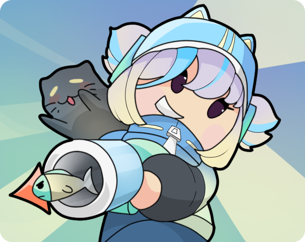



    
    <h1>Герой деревни</h1>

    
    

Победите захватчиков деревни преверженцев Культа Милых Котиков. Будьте осторожны, у каждой ошибки есть последствия...

Данная игра была сделана за три дня для [Maxter's Game Jam 2023](https://itch.io/jam/maxters-jam-2023) и получила довольно хороший [рейтинг](https://itch.io/jam/maxters-jam-2023/rate/1967887) за графическое оформление.

> Автор графики - [Fesvia](https://itch.io/profile/fesvia)

## Галерея

    
    
    

## Лицензирование

Графические ассеты для данной игры распостраняются под лицензией [Creative Commons BY-NC-ND 4.0](AssetsLicense.txt) aka *"Do not redistribute"*.

Код данной игры расопстраняется под лицензией [GNU Affero General Public License 3](CodeLicense.txt).
